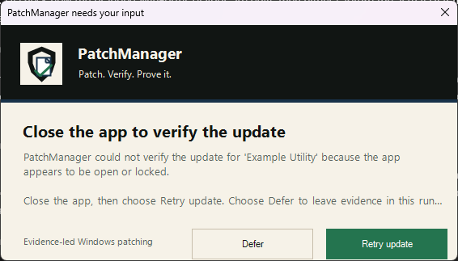
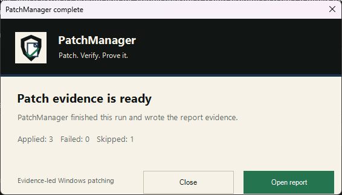
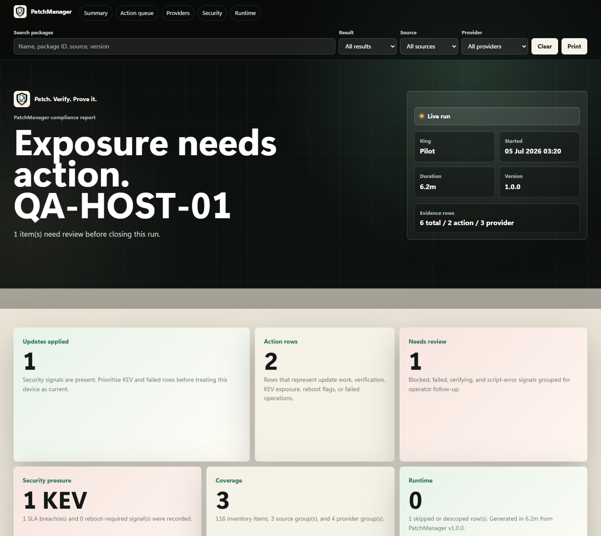
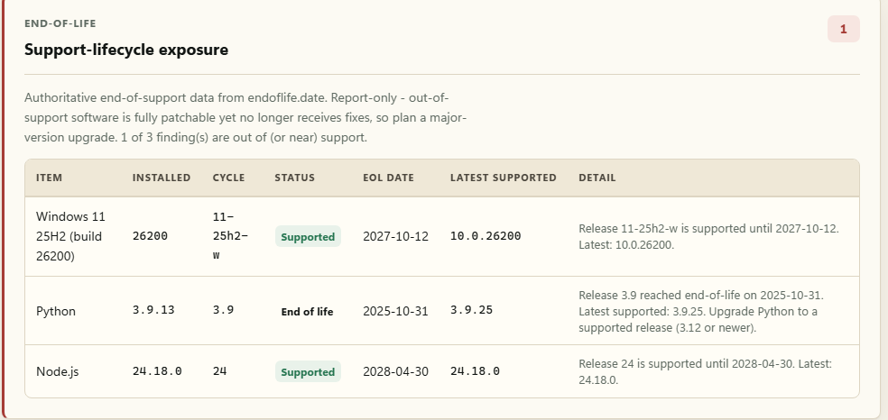
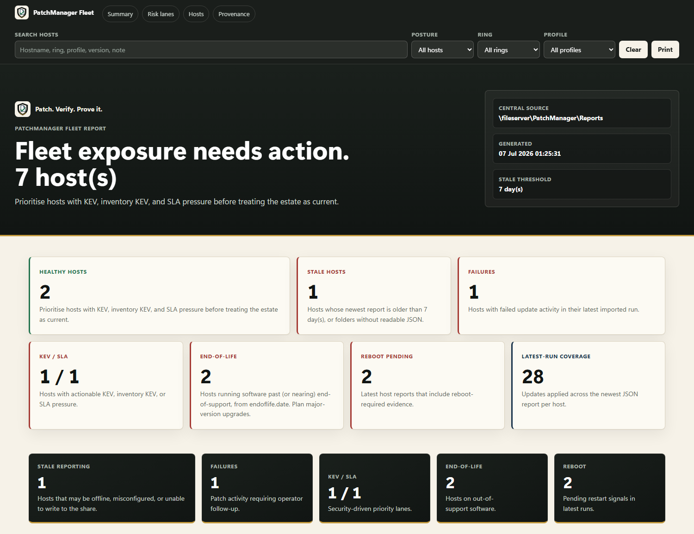

# PatchManager


[](https://github.com/ciaranwhiteside/PatchManager/actions/workflows/ci.yml)
[](LICENSE)


**Patch. Verify. Prove it.**

PatchManager is a single-file PowerShell tool for evidence-led Windows patching.
It discovers and applies updates across **Windows Update, WinGet, the Microsoft
Store, Microsoft 365 Click-to-Run, Chrome, and Edge**, then writes audit-ready
HTML, JSON, and CSV compliance reports. Use it as a set-and-forget updater on a
personal machine or as a fleet patching agent across a commercial estate with
rings, maintenance windows, SLA tracking, CISA KEV emergency handling, and
SIEM-ready event logging.

> **Public beta (v1.3.1).** PatchManager runs elevated and changes installed
> software. Read the script, review the configuration, and always start with a
> dry run.

---

## Contents

- [Why PatchManager](#why-patchmanager)
- [Feature overview](#feature-overview)
- [What it updates](#what-it-updates)
- [Requirements](#requirements)
- [Get started](#get-started)
- [Scheduled runs](#scheduled-runs)
- [Configuration reference](#configuration-reference)
- [Scope profiles: Personal vs Commercial](#scope-profiles-personal-vs-commercial)
- [Reports](#reports)
- [Fleet reporting](#fleet-reporting)
- [Security features](#security-features)
- [Commercial deployment](#commercial-deployment)
- [Exit codes](#exit-codes)
- [Windows Event Log IDs](#windows-event-log-ids)
- [Security considerations](#security-considerations)
- [Data hygiene](#data-hygiene)
- [Troubleshooting & FAQ](#troubleshooting--faq)
- [Tests](#tests)
- [Contributing](#contributing)
- [Brand](#brand)
- [License](#license)

---

## Why PatchManager

Most compromised endpoints are running software with a fix already published.
Windows Update handles the OS, but third-party applications — browsers,
archivers, runtimes, dev tools — are where updates quietly lapse. PatchManager
closes that gap with one auditable script:

- **One run covers everything** — OS, store apps, desktop apps, Office, and
  browsers in a single pass with one consolidated report.
- **Evidence, not vibes** — every row in the report records what was checked,
  what changed, the before/after versions, and *why* anything was skipped.
- **Safe by default** — dry-run mode, maintenance windows, pre-flight checks,
  system restore points, reboot flagging (never forcing), and machine state
  restored on exit.
- **Threat-aware** — the [CISA Known Exploited Vulnerabilities
  catalogue](https://www.cisa.gov/known-exploited-vulnerabilities-catalog) is
  checked every run; actively exploited software bypasses the maintenance
  window, and KEV-listed software with no available update is flagged for
  manual follow-up.
- **No agent, no service, no dependency** — a single `.ps1` file plus a JSON
  config. Deploy it with anything that can run PowerShell.

## Feature overview

| Area | What you get |
|---|---|
| Update engines | Windows Update (COM), WinGet (`winget` + `msstore` sources), Microsoft Store client, Microsoft 365 Click-to-Run, Chrome/Edge native updaters, Chocolatey/Scoop, native vendor updaters (data-driven, extensible), opt-in OEM firmware (Dell/HP/Lenovo) |
| Lifecycle intelligence | Report-only environment staleness (Defender signatures, Windows feature lag, dev runtimes) and end-of-life exposure from [endoflife.date](https://endoflife.date/) (out-of-support Windows/runtimes/inventory software), never counted as patch actions, rolled up estate-wide in the fleet dashboard |
| Reporting | Interactive HTML report, JSON for automation, CSV for SIEM/Excel/Power BI, optional central share copy, fleet dashboard |
| Rollout control | Pilot → Early → Broad rings (registry-driven), maintenance windows, hostname-seeded jitter, per-run update caps |
| Security | CISA KEV emergency bypass, inventory-wide KEV scan, SLA tracking with breach events, Windows Event Log IDs for SIEM |
| Safety | Dry-run mode, pre-flight checks (disk/battery/reboot/network/winget health), system restore point, single-instance mutex, atomic state writes, BITS throttle restored on exit |
| User experience | Optional close-app prompts with retry/defer, completion popup with one-click report open, quiet unattended operation |
| Notifications | Optional webhook run summaries (Teams/Slack/generic JSON), optionally only when something needs attention |

## What it updates

| Source | Default | Notes |
|---|---|---|
| Windows Update | ✅ On | Software/quality updates only. Drivers, optional updates, and feature upgrades are **off** unless explicitly enabled. |
| WinGet (`winget` source) | ✅ On | All upgradable packages, minus a safety exclusion list (App Installer, VCLibs, UI.Xaml, WindowsAppRuntime) and anything you descope. |
| Microsoft Store (`msstore` + Store client) | ✅ On | Store CLI bulk updates when available, Windows MDM bridge fallback, verified against before/after AppX snapshots. |
| Microsoft 365 Apps | ✅ On | Click-to-Run updater, detected automatically; never force-closes Office apps unless configured. |
| Chrome / Edge | ✅ On | Native updaters, used only when the browser is not already covered by an actionable WinGet candidate. |
| Chocolatey | ⚙️ Personal on | `choco outdated` discovery + per-package upgrade. The choco CLI is free, but Chocolatey for Business is paid — so it's **off in commercial profiles pending your explicit licence opt-in** (Personal on). |
| Scoop | ✅ On (user context) | Per-user manager; refreshes buckets and updates all apps. Only runs in a user-context session (never SYSTEM). |
| Native vendor updaters | ✅ On | Headless "apply update now" updaters for apps with no actionable WinGet candidate (built-in: Brave; extend via `VendorUpdaters.ExtraCatalogue`). |
| OEM firmware / BIOS | ⛔ Off | Opt-in only. Dell Command Update / HP Image Assistant / Lenovo System Update. Skipped on battery; never reboots on its own. |
| Environment staleness | 🔎 Report-only | Never patches. Flags stale Microsoft Defender signatures, Windows feature-update lag, and installed dev-runtime versions in their own report section. |
| End-of-life (endoflife.date) | 🔎 Report-only | Never patches. Flags software past (or nearing) end-of-support — out-of-support Windows, dev runtimes, and a best-effort scan of the whole inventory — in its own report section. Cached and offline-safe. |

Commercial profiles keep everything above on except Chocolatey (licence
opt-in). `CommercialManaged` additionally defers Windows Update, Microsoft 365,
browsers, Scoop, and vendor updaters to your management platform — see
[Scope profiles](#scope-profiles-personal-vs-commercial).

What it deliberately does **not** do:

- **Never reboots a machine.** Reboot-required is flagged in the report, the
  event log, and exit code `3010` — the restart decision stays with you.
- **No feature upgrades by default.** Moving from one Windows version to
  another is a project, not a patch.
- **No publisher-managed packages.** Apps that update through their own
  channel (e.g. JetBrains IDEs, Android Studio) are skipped with evidence
  rather than broken.

## Requirements

- Windows 10 or Windows 11
- Windows PowerShell 5.1 (built in) or PowerShell 7+
- [App Installer / WinGet](https://learn.microsoft.com/windows/package-manager/winget/) 1.4+
- An elevated (Administrator) PowerShell session
- Optional: [`Microsoft.WinGet.Client`](https://www.powershellgallery.com/packages/Microsoft.WinGet.Client)
  module — when installed, upgrade discovery uses structured objects instead
  of parsing winget's text output (recommended on non-English systems)

## Get started

All commands run in an **elevated PowerShell** (right-click Start → *Terminal
(Admin)*).

### Personal device

Four commands, and your machine keeps itself patched from then on:

```powershell
# 1. Get the code - straight into an admin-only-writable location
git clone https://github.com/ciaranwhiteside/PatchManager.git C:\ProgramData\PatchManager
cd C:\ProgramData\PatchManager

# 2. Preview - shows exactly what would be updated, changes nothing
.\Invoke-PatchManager.ps1 -DryRun -Force

# 3. Patch for real
.\Invoke-PatchManager.ps1 -Force

# 4. Set and forget - register the automatic startup/logon task
.\Invoke-PatchManager.ps1 -InstallStartupTask
```

Step 4 is the whole point for a personal machine: from now on PatchManager
runs itself a couple of minutes after every startup and logon, patches, and
writes a fresh compliance report every time — no further action from you.
Reports (HTML/JSON/CSV) land in `C:\ProgramData\PatchManager\Reports`, and
the completion popup offers to open the latest one. No configuration needed:
the defaults suit a personal machine. See [Scheduled runs](#scheduled-runs)
for how the task behaves and how to remove it.

### Commercial / managed estate

One decision up front, then a pilot:

- **`Commercial`** — full coverage plus fleet behaviours. PatchManager patches
  everything it can (Windows Update, Office, browsers, third-party apps) and
  adds estate-friendly behaviour: run-scoped bandwidth throttling and jittered
  scheduling. **Pick this unless something else already patches your OS and
  browsers** — an unpatched Chrome is a vulnerability whether or not you have
  an RMM.
- **`CommercialManaged`** — for estates where Intune/SCCM/WSUS/RMM already
  owns OS, Office, and browser patching. Those areas are descoped (recorded in
  every report as a decision, not a miss) and PatchManager covers the
  third-party gap your platform doesn't. The inventory-wide CISA KEV scan
  still flags exposure in the managed software, so nothing goes invisible.

```powershell
# 1. Get the code onto a pilot device
git clone https://github.com/ciaranwhiteside/PatchManager.git C:\ProgramData\PatchManager
cd C:\ProgramData\PatchManager

# 2. Create a config with your profile and central share
Copy-Item .\PatchManager.config.example.json .\PatchManager.config.json
notepad .\PatchManager.config.json
#   "ScopeProfile": "Commercial"          (or "CommercialManaged")
#   "Reporting":    { "CentralReportPath": "\\\\fileserver\\PatchManager\\Reports" }

# 3. Preview on the pilot - review the report, confirm the scope is right
.\Invoke-PatchManager.ps1 -DryRun -Force

# 4. Live run on the pilot, then check the estate view
.\Invoke-PatchManager.ps1 -Force
.\Get-FleetReport.ps1 -CentralReportPath '\\fileserver\PatchManager\Reports' -OpenReport
```

Happy with the pilot? Roll out with your deployment tooling — rings via
registry, nightly scheduled task, SIEM wiring — following
[Commercial deployment](#commercial-deployment). Fine-tune what's in scope
with [scope profiles and descoping](#scope-profiles-personal-vs-commercial).

### Notes for both paths

- **No git?** Download the [latest release
  ZIP](https://github.com/ciaranwhiteside/PatchManager/releases/latest),
  extract it, and put the contents at `C:\ProgramData\PatchManager` (so the
  script is `C:\ProgramData\PatchManager\Invoke-PatchManager.ps1`), then run
  `Unblock-File C:\ProgramData\PatchManager\*.ps1` once before running it.
- **`-Force` only bypasses the maintenance-window wait** so your manual run
  starts immediately — every other safety (pre-flight checks, dry-run
  semantics, restore point) still applies.
- **Just want a report?** `.\Invoke-PatchManager.ps1 -ReportOnly -Force`
  audits without patching.
- Every setting is documented in the
  [configuration reference](#configuration-reference).

### Parameters

| Parameter | Purpose |
|---|---|
| `-DryRun` | Simulate everything; report what *would* be updated. |
| `-ReportOnly` | Discovery and compliance report only, no patching. |
| `-Force` | Ignore the maintenance window for this run. |
| `-ConfigPath <path>` | Use a specific config file (default: `PatchManager.config.json` next to the script). |
| `-ForceRing Pilot\|Early\|Broad` | Override ring detection for this run. |
| `-InstallStartupTask` | Register a scheduled task (startup + logon triggers). |
| `-UninstallStartupTask` | Remove that scheduled task. |
| `-TaskName <name>` / `-TaskDelayMinutes <n>` | Customise the scheduled task. |

## Scheduled runs

`-InstallStartupTask` (step 4 above) registers a scheduled task that runs
PatchManager elevated a couple of minutes after every startup and logon.

How the task behaves:

- **It runs silently in the background** — no console window on your screen
  (Windows may flash one briefly at launch). When a run finishes, the
  completion popup still appears with the one-click *Open report* button.
- **It patches right away rather than waiting for the maintenance window.**
  The task runs with `-Force` deliberately: a personal machine that's asleep
  overnight would otherwise never reach a 22:00–06:00 window. All other
  safeties still apply — pre-flight checks (disk, battery, pending reboot,
  connectivity), restore point, and reboot flagging.
- **It never overlaps itself** thanks to the single-instance mutex, so dense
  startup/logon triggers are safe.
- **It stays out of your way if you ask it to**: enable
  `PreFlight.RequireUserIdle` in the config and runs quietly defer while
  you're actively using the machine, retrying at the next trigger.
- If you *do* want scheduled runs held to a maintenance window, create your
  own task with Task Scheduler pointing at the script **without** `-Force`
  (this is the normal pattern for commercial estates — see
  [Commercial deployment](#commercial-deployment)).

> **Why `C:\ProgramData\PatchManager`?** The task runs elevated with
> `-ExecutionPolicy Bypass`. If the script sat somewhere your user account can
> write to, anything running as you could swap the file and gain admin at next
> logon. The installer warns if the path looks user-writable.

To remove the task:

```powershell
.\Invoke-PatchManager.ps1 -UninstallStartupTask
```

## Configuration reference

Copy `PatchManager.config.example.json` to `PatchManager.config.json` and
override only the keys you care about — unspecified keys keep their defaults,
sections merge key-by-key, and `_comment` keys are ignored.
`PatchManager.config.json` is git-ignored on purpose: it may contain local
paths and share names.

### `ScopeProfile`

| Key | Default | Purpose |
|---|---|---|
| `ScopeProfile` | `"Personal"` | `Personal`, `Commercial` (full coverage + fleet behaviours), or `CommercialManaged` (defer OS/Office/browsers to your platform). See [Scope profiles](#scope-profiles-personal-vs-commercial). |

### `Descope`

Everything descoped still appears in the report — as `Descoped`, with a reason
— so auditors can see it was a decision, not a miss.

| Key | Default | Purpose |
|---|---|---|
| `PackageIds` | `[]` | Package-ID prefixes to exclude (e.g. `"Google.Chrome"`). |
| `PackageNamePatterns` | `[]` | Regex patterns matched against package names. |
| `Providers` | `[]` | Whole providers to exclude (e.g. `"edge-update"`). |
| `Sources` | `[]` | Whole sources to exclude (e.g. `"msstore"`). |
| `Reasons` | `{}` | Map of descope key → human-readable reason shown in reports. |

### `Ring`

| Key | Default | Purpose |
|---|---|---|
| `RegistryPath` / `RegistryKey` | `HKLM:\SOFTWARE\Company\PatchManager` / `DeploymentRing` | Where the device's ring is read from. Set per device via GPO/Intune/imaging. |
| `Default` | `"Pilot"` | Ring used when the registry value is absent. |
| `Delays` | `Pilot 0 / Early 3 / Broad 7` | Suggested stagger (days) — advisory; enforce via your deployment tooling. |

### `MaintenanceWindow`

| Key | Default | Purpose |
|---|---|---|
| `Enabled` | `true` | Enforce the window (bypassed by `-Force` and KEV emergencies). |
| `StartHour` / `EndHour` | `22` / `6` | Window in local time; overnight windows (start > end) are supported. |
| `AllowedDays` | all days | Days on which patching may run. |
| `JitterMaxMinutes` | `null` → profile | Hostname-seeded random delay so a fleet doesn't hit the network at once. `null` resolves by profile: Personal `0` (a single device gains nothing from delaying itself), Commercial/CommercialManaged `120`. Rings scale it: Pilot 30%, Early 65%, Broad 100%. |

### `Network`

| Key | Default | Purpose |
|---|---|---|
| `BITSThrottleEnabled` | `null` | `null` = decide by profile (Personal **off**, Commercial/CommercialManaged **on**). The BITS policy is applied for the run only and **restored afterwards**, even on crash. |
| `BITSMaxBandwidthKbps` | `4096` | Per-machine BITS cap while patching. |
| `TestConnectivityUrl` | `https://www.cloudflare.com` | Pre-flight connectivity probe (HEAD, GET fallback). |
| `ConnectivityTimeoutSec` | `10` | Probe timeout. |

### `WinGet`

| Key | Default | Purpose |
|---|---|---|
| `ExcludePackagePrefixes` | App Installer, VCLibs, UI.Xaml, WindowsAppRuntime | Component packages that should not be swapped mid-run. |
| `ApprovedPackages` | `[]` | Allow-list mode: when non-empty, **only** these IDs are updated. |
| `PublisherManagedPackageIds` | `["Google.AndroidStudio"]` | Packages that must update through their own vendor flow. |
| `IncludeMSStore` | `true` | Also query the `msstore` source. |
| `Scope` | `"machine"` | winget install scope. |
| `AcceptAgreements` | `true` | Non-interactive agreement acceptance. |
| `PackageTimeoutSeconds` | `300` | Per-package timeout. |
| `MaxUpdatesPerRun` | `0` | Cap updates per run (`0` = unlimited); KEV matches are prioritised first. |
| `SuppressReboot` | `true` | Appends `/norestart` via `--custom` (winget 1.4+) so installers don't reboot mid-run. |
| `MaxRetries` | `2` | Attempts per package for transient failures (linear backoff). |

### `WindowsUpdate`

| Key | Default | Purpose |
|---|---|---|
| `Enabled` | `true` (`false` on CommercialManaged) | Windows Update provider on/off. |
| `IncludeDrivers` / `IncludeOptionalUpdates` / `IncludeFeatureUpdates` | `false` | Opt-in expansions of scope. |
| `SearchCriteria` | `IsInstalled=0 and IsHidden=0 and Type='Software'` | WUA search criteria. |
| `TimeoutSeconds` | `3600` | **Enforced** watchdog over the whole search/download/install flow. |

### `Microsoft365`

| Key | Default | Purpose |
|---|---|---|
| `Enabled` | `true` (`false` on CommercialManaged) | Click-to-Run updates on/off. |
| `ForceAppShutdown` | `false` | Whether the C2R updater may close running Office apps. |
| `TimeoutSeconds` | `1800` | Updater timeout. |

### `Browsers`

| Key | Default | Purpose |
|---|---|---|
| `Enabled` / `ChromeEnabled` / `EdgeEnabled` | `true` (Chrome/Edge `false` on CommercialManaged) | Native browser updaters, used only when WinGet has no actionable candidate. |
| `NativeTimeoutSeconds` | `900` | Native updater timeout. |

### `PackageManagers`

| Key | Default | Purpose |
|---|---|---|
| `ChocolateyEnabled` | `null` → profile | `null` resolves by profile: Personal **on** (the choco CLI is free), Commercial/CommercialManaged **off** pending your explicit opt-in. Chocolatey for Business is a paid product — enabling it commercially is your licence decision. An explicit `true`/`false` always wins. |
| `ScoopEnabled` | `true` (`false` on CommercialManaged) | Per-user Scoop; only runs in a user-context session. |
| `TimeoutSeconds` | `300` | Per-command timeout for both managers. |
| `MaxUpdatesPerRun` | `0` | Cap Chocolatey upgrades per run (`0` = unlimited). |

### `VendorUpdaters`

| Key | Default | Purpose |
|---|---|---|
| `Enabled` | `true` (`false` on CommercialManaged) | Drives headless "apply update now" updaters for apps with no actionable WinGet candidate. |
| `NativeTimeoutSeconds` | `900` | Updater timeout. |
| `ExtraCatalogue` | `[]` | Add your own Omaha-style updaters. Each entry: `Name`, `PackageId`, `Provider`, `WinGetOverlapId`, `VersionRegistryPaths`, `VersionValueName`, `UpdaterPathCandidates`, `UpdaterArgs`. Built-in: Brave. |

### `Firmware`

| Key | Default | Purpose |
|---|---|---|
| `Enabled` | `false` (**all profiles**) | OEM firmware/BIOS/driver updates via Dell Command Update / HP Image Assistant / Lenovo System Update. Opt-in only — firmware carries real risk. Skipped on battery; never reboots on its own. |
| `TimeoutSeconds` | `1800` | Per-command (scan + apply) timeout. |

### `StalenessReport`

Report-only — never patches. Findings appear in their own report section and
are excluded from the applied/failed counts. On for all profiles.

| Key | Default | Purpose |
|---|---|---|
| `Enabled` | `true` | Master switch for the staleness checks. |
| `DefenderSignatures` / `DefenderMaxAgeDays` | `true` / `7` | Flag Microsoft Defender if signatures are older than N days. |
| `FeatureUpdateLag` / `FeatureUpdateMaxAgeDays` | `true` / `365` | Flag the installed Windows feature version if it's older than N days. |
| `DevRuntimes` | `true` | Report installed .NET SDK / Python / Node.js versions as evidence. |

### `EndOfLife`

Report-only — never patches. Adds authoritative **end-of-support** intelligence
from [endoflife.date]([https://endoflife.date/](https://github.com/endoflife-date/endoflife.date)): software can be fully patched yet
sit on a release line the vendor no longer fixes. Findings appear in their own
report section (HTML panel + JSON + a `.endoflife.csv`) and are excluded from the
applied/failed counts. On for all profiles. Product data is cached and the run is
offline-safe — a stale cache is used if a fetch fails, and `Offline: true` never
touches the network.

| Key | Default | Purpose |
|---|---|---|
| `Enabled` | `true` | Master switch for the end-of-life checks. |
| `ApiBaseUrl` | `https://endoflife.date/api/v1` | endoflife.date v1 API base. |
| `CacheHours` / `CachePath` | `168` / `…\Cache` | Per-product cache TTL (7 days; lifecycle data moves slowly) and location (shared with the KEV cache). |
| `WarnWithinDays` | `90` | Flag releases whose end-of-support falls within this window as *near-EOL*. |
| `CheckWindows` | `true` | Authoritatively flag an out-of-support Windows feature version (build + edition aware). |
| `CheckRuntimes` | `true` | Flag out-of-support .NET / Python / Node.js, with the latest supported version. |
| `InventoryScan` / `InventoryMaxLookups` | `true` / `40` | Best-effort match of the whole software inventory against endoflife.date; only actual EOL/near-EOL is surfaced, capped at N network lookups per run. |
| `Offline` | `false` | `true` = use the cache only, never fetch (air-gapped estates). |

### `UserExperience`

| Key | Default | Purpose |
|---|---|---|
| `Enabled` | `true` | Master switch for all dialogs (auto-disabled in non-interactive sessions). |
| `PromptOnAppInUse` | `true` | Ask the user to close a blocking app, with Retry/Defer. |
| `CompletionPopup` | `true` | Show a summary popup when the run finishes. |
| `OpenReportPrompt` | `true` | Offer a one-click "Open report" button. |
| `PromptTimeoutSeconds` | `900` | Auto-defer if the user doesn't respond. |
| `ShowOnDryRun` | `true` | Also show the popup for dry runs. |

If an app is still running when PatchManager tries to verify an update, the
user can close it and retry immediately or defer the item to the next run.



When a run finishes, the completion popup summarizes the outcome and can open
the HTML report directly.



### `MicrosoftStore`

| Key | Default | Purpose |
|---|---|---|
| `Enabled` | `true` | Store client updates on/off. |
| `Provider` | `"Auto"` | `Auto` (Store CLI, then MDM bridge), `StoreCli`, or `Cim`. |
| `TimeoutSeconds` | `180` | Per-command timeout. |
| `UseCimFallback` | `true` | Fall back to the Windows MDM bridge update scan. |
| `CaptureAppxDiff` | `true` | Verify results with before/after AppX snapshots. |
| `PostUpdateSettleSeconds` | `20` | Wait before the post-update snapshot. |

### `SLA`

| Key | Default | Purpose |
|---|---|---|
| `Critical` / `High` / `Medium` / `Low` | `14` | Days from *update available* to *update applied* before a breach is reported. The clock starts when PatchManager first sees the update, not at CVE publication. |

### `Logging`

| Key | Default | Purpose |
|---|---|---|
| `LocalLogPath` | `C:\ProgramData\PatchManager\Logs` | Daily log files. |
| `CentralLogPath` | `""` | Optional UNC share; logs are copied per-host with retries. |
| `EventLogSource` | `PatchManager` | Application event log source for SIEM. |
| `RetentionDays` | `90` | Local log/report retention. |
| `LogLevel` | `Info` | `Debug`, `Info`, `Warning`, or `Error`. |

### `Reporting`

| Key | Default | Purpose |
|---|---|---|
| `LocalReportPath` | `C:\ProgramData\PatchManager\Reports` | Where per-run reports are written. |
| `CentralReportPath` | `""` | Optional UNC share; reports are copied to `<share>\<HOSTNAME>\`. Feeds [Get-FleetReport.ps1](Get-FleetReport.ps1). |
| `GenerateHTML` / `GenerateJSON` / `GenerateCSV` | `true` | Which report formats to produce. |

### `Notifications`

| Key | Default | Purpose |
|---|---|---|
| `Enabled` | `false` | Post a run summary to a webhook. |
| `WebhookUrl` | `""` | Teams/Slack incoming webhook or any JSON endpoint. Payload includes a plain `text` field plus structured counters. |
| `OnlyOnProblems` | `true` | Only post when a run has failures, KEV matches, SLA breaches, or errors. |
| `TimeoutSec` | `15` | Webhook post timeout. A webhook failure never fails the run. |

### `SelfUpdate`

A stale patch tool is a liability, so self-update is **on by default for
Personal and Commercial** and **off for CommercialManaged** (a managed estate's
platform should own how PatchManager is deployed). By default it tracks the
newest **published GitHub release** — never a moving branch, never a
pre-release — so only cut, reviewed releases ship. It checks the release for a
newer `Invoke-PatchManager.ps1`, refuses anything that isn't a strictly newer
version, validates that the download parses as PowerShell, optionally verifies
a pinned SHA256, backs up the current script, and installs the new copy **for
the next run** (it never executes freshly downloaded code inline). Git-clone
installs are supported: self-update replaces only `Invoke-PatchManager.ps1`, so
use `git pull` when you want the full repo, docs, config example, and tests
refreshed. Apply is skipped in dry-run/report-only.

> Existing git-clone installs on v1.2.1 or earlier need one manual `git pull`
> to receive this updater fix, because those older scripts exited before
> checking GitHub. After that, clone installs can self-update the script.

| Key | Default | Purpose |
|---|---|---|
| `Enabled` | `null` → profile | `null` resolves by profile: Personal/Commercial **on**, CommercialManaged **off**. An explicit `true`/`false` always wins. Keep the script in an admin-only-writable directory when enabled. |
| `Repository` | `"ciaranwhiteside/PatchManager"` | GitHub `owner/repo` to fetch from. URL values are rejected. |
| `Ref` | `"latest"` | `latest` = newest published release tag (recommended). Pin a specific tag to freeze, or use `"main"` to track the branch. Path traversal and URL metacharacters are rejected. |
| `AutoApply` | `true` | `true` installs a validated newer script; `false` only reports that an update is available. |
| `ExpectedSha256` | `""` | Optional exact SHA256 hash pin for locked-down deployments. |
| `TimeoutSec` | `30` | Per-request timeout. A self-update failure never fails the patch run. |

> **Supply-chain note.** Enabling self-update means trusting the configured
> repository's release process to run code as administrator — the same trust as
> installing PatchManager in the first place. It only ever installs published,
> version-newer, parse-valid releases. For maximum control, pin `ExpectedSha256`
> or a specific `Ref`, set `AutoApply: false` to review first, or disable it and
> deploy via your own tooling.

### `State`, `PreFlight`, `SystemRestore`, `CISAKEV`

| Key | Default | Purpose |
|---|---|---|
| `State.StatePath` / `StateFile` | `C:\ProgramData\PatchManager\State` / `patch_state.json` | SLA tracking state (written atomically). |
| `PreFlight.MinFreeSpaceGB` | `5` | Abort if the system drive is below this. |
| `PreFlight.CheckBattery` / `MinBatteryPercent` / `RequireACPower` | `true` / `20` / `false` | Laptop protections. |
| `PreFlight.AbortOnPendingReboot` | `true` | Don't patch on top of a half-applied state. |
| `PreFlight.RequireUserIdle` / `MinIdleMinutes` | `false` / `5` | Defer gracefully while the user is active (great for scheduled tasks). |
| `SystemRestore.Enabled` | `true` | Create a restore point before patching (throttled to one per 24 h by Windows). |
| `CISAKEV.Enabled` | `true` | Fetch and match the KEV catalogue. |
| `CISAKEV.FeedUrl` / `CacheHours` / `CachePath` | CISA feed / `24` / `C:\ProgramData\PatchManager\Cache` | Feed caching; a stale cache is used if the fetch fails. |

## Scope profiles: Personal vs Commercial

The guiding principle: **maximum coverage by default**. Nothing is descoped
unless you explicitly say another system owns it — an unpatched application is
a vulnerability regardless of the size of your organisation.

| Profile | Coverage | Fleet behaviours | Pick it when |
|---|---|---|---|
| `Personal` (default) | Everything: Windows Update, Microsoft 365, browsers, WinGet, Store | None (patch immediately, no throttling) | It's your own machine. |
| `Commercial` | Everything — same full coverage as Personal | BITS throttling + jitter staggering (up to 120 min, scaled by ring) | Your organisation has no dedicated patch platform, or you want belt-and-braces coverage. **The safe default for orgs.** |
| `CommercialManaged` | Third-party gap only | Same as Commercial | Intune/SCCM/WSUS/RMM genuinely already patches your OS, Office, and browsers. |

`CommercialManaged` automatically:

- disables the Windows Update, Microsoft 365, Chrome, Edge, Scoop, and native
  vendor-updater providers,
- descopes Chrome/Edge/WebView2/Office/Teams/OneDrive WinGet packages (with
  audit-visible reasons in every report — a decision, not a miss).

Report-only safety nets remain **on for every profile, including
`CommercialManaged`** — none of them change the machine, so there's no reason
to defer them to your management platform:

- The **inventory-wide CISA KEV scan** covers *all* installed software,
  including the managed apps — if your platform falls behind on an actively
  exploited Chrome, the report still flags it.
- The **environment staleness** and **end-of-life** scans keep checking the
  managed apps too — a platform that patches Chrome doesn't necessarily catch
  an out-of-support Windows feature version or a Chrome release line that's
  gone EOL, and the fleet dashboard rolls both up estate-wide.
- Every descoped row appears in the report with its reason, so an auditor can
  see exactly what PatchManager deferred to the platform.

Everything a profile does can be overridden per-key in your config, and
finer-grained exclusions go in `Descope` — for example, if your RMM manages
Zoom:

```json
{
  "Descope": {
    "PackageIds": ["Zoom.Zoom"],
    "Reasons": { "Zoom.Zoom": "Managed by RMM policy 12-B." }
  }
}
```

## Reports



Each run writes up to three artifacts to `Reporting.LocalReportPath` (and the
central share if configured):

- **HTML** — interactive: search, status/source/provider filters, sortable
  columns, print-friendly. Actionable package updates are separated from
  source/provider audit checks and from skipped/descoped rows, so "what
  changed" is never buried under "what was checked".
- **JSON** — full machine-readable results: metadata, statistics, status /
  source / provider summaries, attention items, reboot-required items, every
  update row, KEV matches (actionable + inventory), SLA breaches, environment
  staleness, and end-of-life findings.
- **CSV** — flat per-row export for SIEM ingestion, Excel, or Power BI (plus
  companion `.staleness.csv` and `.endoflife.csv` for the report-only checks).

Report-only panels sit alongside the patch results — for example, the
**End-of-life** panel flags software whose whole release line is out of support
(fully patched, yet no longer receiving fixes), sourced from endoflife.date:



### Status glossary

| Status | Meaning |
|---|---|
| `Planned` | Dry-run: this action would be attempted. |
| `Succeeded` | Update applied and verified. |
| `Updated` | Version changed after an update action. |
| `AlreadyCurrent` | Provider checked; item was already up to date. |
| `Skipped` | Intentionally not patched this run (reason in Evidence). |
| `Descoped` | Excluded by profile or `Descope` config (reason in Evidence). |
| `Blocked` | Could not proceed — usually the app was open; remediation included. |
| `Failed` | Provider or update action failed (evidence included). |
| `Verifying` | Update command completed; final state pending confirmation. |
| `Completed` | Source/provider check finished — audit evidence, not a package update. |

## Fleet reporting



Point every device's `Reporting.CentralReportPath` at the same share, then run
the aggregator from anywhere that can read it (read-only, no elevation):

```powershell
.\Get-FleetReport.ps1 -CentralReportPath '\\fileserver\PatchManager\Reports' -StaleDays 7 -OpenReport
```

You get one HTML dashboard and CSV covering every host's most recent run:
last-seen time with **stale-host flagging**, ring, profile, applied/failed
counts, KEV matches (actionable and inventory), SLA breaches, **end-of-life
exposure** (hosts running out-of-support software, from the per-host
endoflife.date findings), script errors, and pending reboots — the "is my
estate actually patched, and is any of it abandoned?" view.

To preview the fleet dashboard on one machine before you have a central share,
wrap the newest local JSON report in a host-named folder and point the
aggregator at that test root:

```powershell
$central = 'C:\ProgramData\PatchManager\FleetTestCentral'
$out = 'C:\ProgramData\PatchManager\Reports'
$hostFolder = Join-Path $central $env:COMPUTERNAME
New-Item -ItemType Directory -Path $hostFolder -Force | Out-Null

$latestJson = Get-ChildItem $out -Filter 'PatchReport_*.json' |
  Sort-Object LastWriteTime -Descending |
  Select-Object -First 1

Copy-Item $latestJson.FullName $hostFolder -Force
.\Get-FleetReport.ps1 -CentralReportPath $central -OutputPath $out -StaleDays 7 -OpenReport
```

## Security features

- **CISA KEV emergency handling** — every run downloads (and caches) the Known
  Exploited Vulnerabilities catalogue. If an available upgrade matches a KEV
  entry, PatchManager declares an emergency: the maintenance window is
  bypassed, jitter is capped at 5 minutes, the matching packages are patched
  first, and event `9001` is raised for your SIEM.
- **Inventory-wide KEV visibility** — installed software that matches the KEV
  catalogue but has *no* available update through PatchManager's sources is
  reported in its own section, so exposure isn't invisible just because
  there's nothing to click. Verify the installed version against the CVE and
  update through the vendor if affected.
- **SLA tracking** — the moment an update becomes available it is tracked in
  local state; if it is still unapplied after the configured window (default
  14 days) the run reports a breach and raises event `1020`.
- **Word-boundary KEV matching** with vendor+product agreement, minimum-length
  guards, and Microsoft-Windows exclusions to keep false positives out of your
  emergency path.

## Commercial deployment

1. **Stage the script** at an admin-only-writable path on each device, e.g.
   `C:\ProgramData\PatchManager\` (Intune Win32 app, SCCM package, GPO file
   copy, or your RMM).
2. **Drop a config** next to it with `"ScopeProfile": "Commercial"` (or
   `"CommercialManaged"` if a platform already patches OS/Office/browsers),
   your central share paths, and any descoping.
3. **Assign rings** by writing `DeploymentRing` (`Pilot`/`Early`/`Broad`) to
   `HKLM:\SOFTWARE\Company\PatchManager` via GPO/Intune — pilot a small group,
   then let `Early` and `Broad` follow.
4. **Schedule it** — either `-InstallStartupTask`, or your own scheduled
   task/Intune remediation running
   `powershell.exe -NoProfile -ExecutionPolicy Bypass -File C:\ProgramData\PatchManager\Invoke-PatchManager.ps1`
   nightly. The maintenance window, jitter, idle checks, and the
   single-instance mutex make dense schedules safe.
5. **Collect evidence** — set `Reporting.CentralReportPath` and
   `Logging.CentralLogPath` to per-purpose UNC shares, run
   `Get-FleetReport.ps1` on a schedule, and ingest events `1000–9001` and/or
   the CSV into your SIEM.
6. **Get told when it matters** — point `Notifications.WebhookUrl` at a
   Teams/Slack channel with `OnlyOnProblems: true`.

## Exit codes

| Code | Meaning |
|---|---|
| `0` | Success. |
| `1` | Completed with errors (see report / event log). |
| `2` | Pre-flight failure — no changes made. |
| `3010` | Success — reboot required to finish (standard MSI convention). |
| `99` | Fatal unhandled exception. |

## Windows Event Log IDs

Source `PatchManager`, log `Application` — for SIEM correlation:

| ID | Level | Event |
|---|---|---|
| `1000` | Info | Run started |
| `1001` | Error | Error (general) |
| `1002` | Warning | Warning (general) |
| `1010` | Info | Run completed successfully |
| `1011` | Warning | Run completed with errors |
| `1020` | Error | SLA breach detected |
| `1030` | Info | PatchManager self-updated; new script takes effect on next run |
| `3010` | Warning | Reboot required |
| `9001` | Error | **CISA KEV emergency** — actively exploited vulnerability matched on this host |

## Security considerations

- PatchManager requires and runs with **administrator rights**; it installs
  software. Review the script before first use — it is a single readable file.
- Keep the script in an **admin-only-writable directory** when running it from
  a scheduled task (see [Scheduled runs](#scheduled-runs)).
- If `SelfUpdate.Enabled` is turned on, keep the script in an
  **admin-only-writable directory**, pin `ExpectedSha256` where possible, and
  prefer a release tag in `SelfUpdate.Ref` over a moving branch for broad
  deployments.
- Machine-wide changes are **reverted on exit**: the BITS policy snapshot is
  restored even after a crash. The only persistent artifacts are logs,
  reports, state, cache, and the optional scheduled task.
- TLS 1.2 is enforced for feed downloads on Windows PowerShell 5.1.
- Vulnerability reports: see [SECURITY.md](SECURITY.md).

## Data hygiene

Never publish the generated `Logs/`, `Reports/`, `State/`, or `Cache/`
directories, nor your personal `PatchManager.config.json` — they can contain
hostnames, local user paths, package inventories, and update history. All are
git-ignored, and the test suite scans the public files for common leaks.

## Troubleshooting & FAQ

**Pre-flight fails with "winget.exe not found".**
Install/update *App Installer* from the Microsoft Store — see
[Microsoft's WinGet documentation](https://learn.microsoft.com/windows/package-manager/winget/)
for offline/managed installation options. PatchManager also looks in
`Program Files\WindowsApps` for SYSTEM-context runs.

**A package is always `Blocked`.**
The app (or one of its components) is running. Close it and rerun, or let the
interactive prompt's *Retry* handle it. Unattended runs defer and try again
next run.

**Why didn't PatchManager update Chrome/Office on my work laptop?**
You're on the `CommercialManaged` profile, which descopes those on the
explicit assumption your management platform owns them. Check the *Skipped
and descoped* section of the report — the reason is recorded there. If
nothing else actually patches them, switch to `ScopeProfile: "Commercial"`
for full coverage, or override the individual providers per-key.

**Does `-Force` skip safety checks?**
No — it only bypasses the maintenance window. Pre-flight checks, restore
points, and reboot flagging all still apply.

**Reports show `Verifying` — is that a failure?**
Not necessarily: the update command completed but the final state couldn't be
confirmed yet (common with Store apps that finish asynchronously). It's
counted under "needs review" so it never silently disappears.

**Can it run as SYSTEM (Intune/SCCM)?**
Yes. WinGet is resolved from `WindowsApps` for SYSTEM contexts, dialogs
auto-disable in non-interactive sessions, and per-user installs are discovered
by enumerating loaded user hives.

**Non-English Windows?**
Install the `Microsoft.WinGet.Client` module — discovery then uses structured
objects instead of parsing winget's localised text table.

## Tests

```powershell
.\Tests\Invoke-PatchManager.Static.Tests.ps1
```

Dependency-free static and fixture tests: parser health, winget table parsing
against captured fixtures, config merge and scope profiles, descoping rules,
maintenance window math, SLA state lifecycle, report grouping and counters,
and a scan for personal data in public files. CI runs the same suite plus
PSScriptAnalyzer on Windows PowerShell 5.1 **and** PowerShell 7.

## Contributing

Issues and pull requests are welcome — see
[CONTRIBUTING.md](CONTRIBUTING.md) for the project constraints (single-file
script, PS 5.1 floor, never reboot, restore machine state) and the local
dev loop.

## Brand

PatchManager's lightweight identity system lives in
[docs/brand](docs/brand/BRAND.md). It includes SVG-only logo assets, palette
guidance, and the visual rules used by the public docs and offline HTML reports.

## License

[MIT](LICENSE). Provided as-is; you are responsible for validating it in your
environment before broad deployment.
